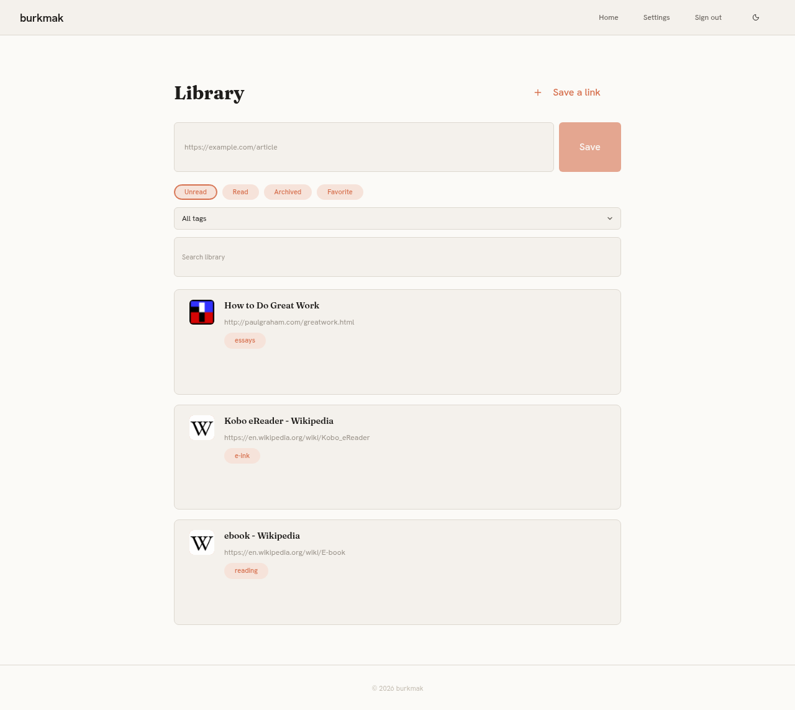
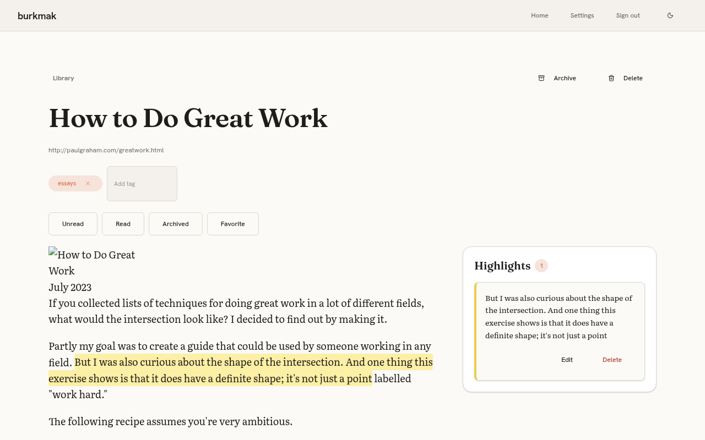
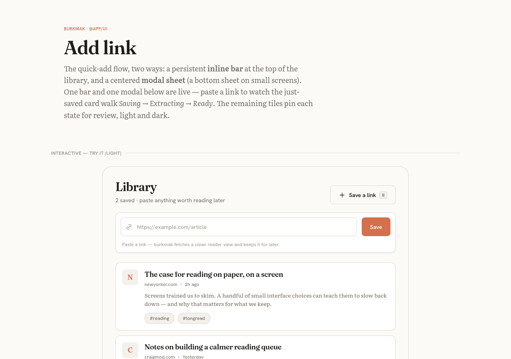
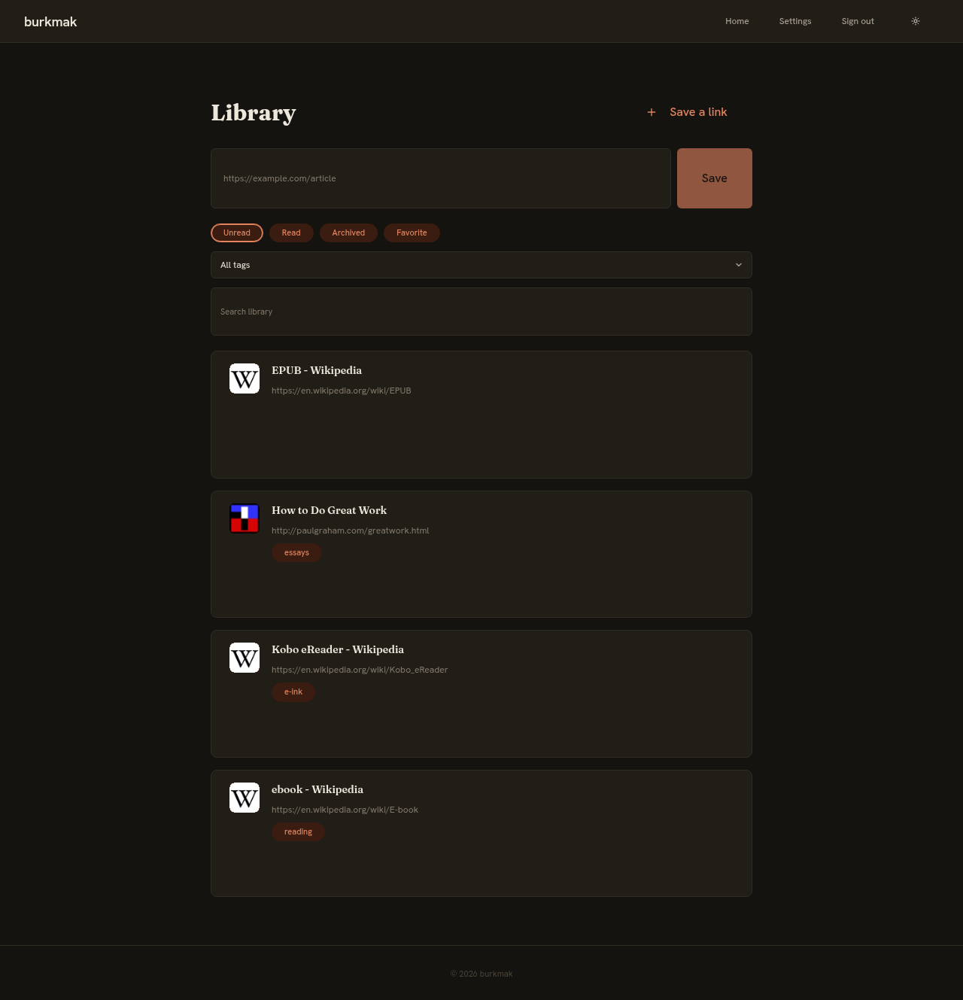
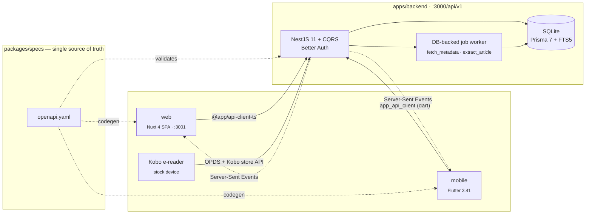

# burkmak

**A quiet home for everything you mean to read.** Self-hosted, multi-user
read-it-later: save a link from anywhere, read it in a clean reader, highlight
what matters — then sync it to your Kobo and export your notes to Obsidian.

burkmak is an Omnivore-style core with two differentiators built in from the
roadmap up: **native Kobo sync** and **Obsidian export**. It runs on a small
stack — NestJS + SQLite + Nuxt + Flutter — so a single binary-shaped deployment
serves the web app, the mobile app, and your e-reader.

> Status: **P1–P6 shipped** — save/organise, extraction/reader/highlights/
> full-text search, capture surfaces, Kobo (OPDS **and native store-protocol
> sync with reading-state write-back**), Obsidian export, dark theme, and
> **auto-extraction on save**. One honest ceiling remains: native sync is
> verified against a full protocol simulation, with the physical-device pass
> still pending (needs HTTPS in front). See the [roadmap](#roadmap).

## Screenshots

|                                                                                 |                                                                     |
| ------------------------------------------------------------------------------- | ------------------------------------------------------------------- |
| **Library**                                                                     | **Reader**                                                          |
|  |  |
| **Save from anywhere**                                                          | **Dark theme**                                                      |
|            |         |

<sub>Live screenshots of the running app (seeded demo library).</sub>

## Features

### Save & organise — _shipped (S1)_

- Save a URL from the web add-bar, the mobile app, a share-sheet, or a
  bookmarklet — every surface hits the same `POST /items`.
- Live metadata: title, site, excerpt, favicon and lead image fill in **without
  a refresh**, pushed over Server-Sent Events as a background job resolves them.
- **Auto-extraction on save** — every saved article is extracted in the
  background automatically, so the reader view, OPDS feed, and Kobo sync are
  ready without another tap (pre-existing libraries are backfilled once).
- Tags, read-state (`unread` / `read` / `archived`), and favorites.
- Filtered, searchable list. **Per-user libraries** — you never see another
  user's data.
- **Light & dark themes** — a one-tap toggle in the header plus a
  system/light/dark preference in Settings.

### Read & highlight — _shipped (S2)_

- **Automatic full-article extraction** (Readability + sanitisation) into a
  clean, ad-free reader view — kept even if the original goes dark. A manual re-extract button covers pages that need a retry.
- Locally-cached article images (SSRF-guarded), served from your own server.
- **Full-text search (SQLite FTS5)** across title, URL, **and** article body —
  same search box, now matches the text inside your saved pieces.
- **Highlights & notes**: select text, pick a colour, attach a note. Authored
  on web, rendered read-only on mobile.

### Capture anywhere — _shipped (S3)_

- **Android share-sheet** target — share a link from any app straight into your
  library (auto-saves; signed-out shares are held and saved after login). iOS
  share extension is a tracked follow-up.
- Desktop **browser bookmarklet** — one click saves the current page via a
  same-origin `/save` popup that reuses your session.
- Spec: [`specs/features/2026-06-14-capture-surfaces.md`](specs/features/2026-06-14-capture-surfaces.md).

### Sync & export — _shipped (S4 · S5)_

- **Kobo sync** (S4 + P6) — two tiers, both served straight from your library,
  no firmware hacking:
  - **OPDS catalog** (`GET /api/v1/opds`) with covers, cursor pagination, and
    OpenSearch, plus EPUB/KEPUB generation
    (`GET /api/v1/items/{id}/epub`). Add it on a stock Kobo via Settings →
    "Add an OPDS catalog".
  - **Native store-protocol sync** (`/api/v1/kobo/{token}/*` — the token
    rides in the URL path because the Kobo's browser can't send auth
    headers): the device pulls new articles automatically on connect, and
    reading state writes back (finish a piece on the Kobo → it's `read` in
    burkmak; archive in the app → it disappears from the device). Point
    `api_endpoint` in `Kobo eReader.conf` at
    `https://<your-host>/api/v1/kobo/<PAT>` — HTTPS required by the device.
    _Verified against a full store-protocol simulation; the physical-device
    pass is the one remaining ceiling._
- **Obsidian export** (S5): a markdown **export API** (one note per article —
  source, metadata, highlights, notes; idempotent via a `burkmakId` frontmatter
  key) + an **[Obsidian plugin](packages/obsidian-plugin)** that syncs it into
  your vault.
- **Personal access tokens** (Settings): a long-lived token for those headless
  clients — Kobo's OPDS reader (HTTP Basic) and the Obsidian plugin (Bearer).

## Roadmap

Phase order: **S0 → S1 → S2**, then **S3 / S4 / S5** in parallel, then a **P6** polish wave. Each phase is
one spec → plan → build cycle. Full detail in [`specs/roadmap.md`](specs/roadmap.md)
and the requirements in [`specs/PRD.md`](specs/PRD.md).

| Phase  | Subsystem | Ships                                                                                                                         | Status     |
| ------ | --------- | ----------------------------------------------------------------------------------------------------------------------------- | ---------- |
| **P1** | S0 + S1   | Foundation (SQLite, jobs + SSE spine) and core library                                                                        | ✅ shipped |
| **P2** | S2        | Article extraction, reader view, FTS5 body search, highlights                                                                 | ✅ shipped |
| **P3** | S3        | Android share-sheet capture, browser bookmarklet                                                                              | ✅ shipped |
| **P4** | S4        | OPDS catalog + EPUB/KEPUB download                                                                                            | ✅ shipped |
| **P5** | S5        | Obsidian export API + Obsidian plugin                                                                                         | ✅ shipped |
| **P6** | polish    | Native Kobo store sync + read-state write-back · OPDS covers/pagination/search · dark theme + switcher · auto-extract on save | ✅ shipped |

## Architecture



- **Spec-first.** `packages/specs/openapi/openapi.yaml` is the source of truth.
  It generates the TypeScript and Dart clients and is enforced at runtime by
  `express-openapi-validator` — the backend physically cannot serve an
  undocumented route.
- **No external services for the core.** SQLite (with FTS5) is the database; a
  DB-backed worker runs background jobs; realtime is plain SSE. The local stack
  is just two containers (`backend`, `web`).

### Stack

| Layer         | Tech                                                                                              |
| ------------- | ------------------------------------------------------------------------------------------------- |
| **Backend**   | NestJS 11 · Prisma 7 (SQLite + FTS5) · CQRS · Better Auth · DB job worker + SSE · RFC 9457 errors |
| **Web**       | Nuxt 4 (SPA, `ssr:false`) · Nuxt UI v4 · Tailwind 4 · `@app/ui` · `@nuxtjs/i18n` (en/ru)          |
| **Mobile**    | Flutter 3.41 · flutter_bloc · get_it · Dio · flutter_secure_storage · slang (en/ru/uk/el)         |
| **Contracts** | OpenAPI 3.1 + AsyncAPI 3.0 → generated `api-client-{ts,dart}` (read-only, codegen-owned)          |
| **Design**    | W3C design tokens → CSS / TS / Dart · `@app/ui` Vue components + colocated Storybook              |

## Repository layout

```
apps/
  backend/          NestJS 11 + Prisma 7 (SQLite) + CQRS + Better Auth
  web/              Nuxt 4 (SPA) + Nuxt UI v4 + Tailwind v4 + @app/ui
  mobile/           Flutter 3.41 + flutter_bloc + get_it + Dio
packages/
  specs/            OpenAPI 3.1 + AsyncAPI 3.0 — single source of API truth
  api-client-ts/    generated TS client — never edit by hand
  api-client-dart/  generated Dart client — never edit by hand
  ui/               @app/ui Vue components + Storybook + specs
  ui_flutter/       app_ui Flutter widgets + theme
  design-tokens/    tokens pipeline: JSON → CSS / TS / Dart
  obsidian-plugin/  Obsidian plugin (esbuild → main.js) for the export API
specs/
  PRD.md            product requirements
  roadmap.md        phase → subsystem map
  HANDOFF.md        cold-start orientation
  features/         per-feature specs + implementation plans
  design/           tokens JSON + mockups + component inventory
  tasks/            active.md (work stack) + done.md (archive)
docker/             compose.yml (backend + web) + service configs
.claude/            project rules (CLAUDE.md), domain handbook, subagent roster
```

## Quick start

```sh
git clone <this-repo> burkmak
cd burkmak
pnpm install
pnpm spec:codegen                       # generate TS + Dart API clients from the spec
pnpm design:build                       # generate CSS / TS / Dart design tokens
docker compose -f docker/compose.yml up -d
curl localhost:3000/api/v1/health       # → {"status":"ok",...}
```

Open **http://localhost:3001** for the web app. Containers mount the repo as a
volume, so edits hot-reload — don't also run `pnpm dev` against the same ports.

For the mobile app: `cd apps/mobile && flutter run` (Flutter 3.41 + Dart 3.8).

### Requirements

- Node.js ≥ 24 · pnpm ≥ 10
- Docker + Docker Compose
- Flutter 3.41 + Dart 3.8 _(only if building mobile)_

## How this project is built

burkmak is developed spec-first with [Claude Code](https://claude.com/claude-code),
and the repo carries the guardrails that keep an agentic workflow honest:

- **Codegen drift guard** — CI regenerates every client from the spec and fails
  on any diff. Generated clients are never hand-edited.
- **Runtime contract validation** — `express-openapi-validator` rejects requests
  that aren't in the OpenAPI spec.
- **Migrations-only database** — every schema change is a committed Prisma
  migration; `prisma db push` is prohibited.
- **Design-token discipline** — Stylelint bans hex literals and inline styles in
  brand components; every colour comes from a token.
- **In-repo task stack** — work is pushed onto
  [`specs/tasks/active.md`](specs/tasks/active.md) and archived to
  [`done.md`](specs/tasks/done.md), not lost in a chat window.

## Documentation

| Topic                                     | File                                                             |
| ----------------------------------------- | ---------------------------------------------------------------- |
| Product requirements                      | [`specs/PRD.md`](specs/PRD.md)                                   |
| Roadmap (phases → subsystems)             | [`specs/roadmap.md`](specs/roadmap.md)                           |
| Cold-start orientation                    | [`specs/HANDOFF.md`](specs/HANDOFF.md)                           |
| Feature specs + implementation plans      | [`specs/features/`](specs/features)                              |
| Design system, tokens, mockups            | [`specs/design/README.md`](specs/design/README.md)               |
| Backend · CQRS · Prisma · API conventions | [`.claude/docs/handbook.md`](.claude/docs/handbook.md)           |
| Design system · `@app/ui` · tokens · BEM  | [`.claude/docs/design-system.md`](.claude/docs/design-system.md) |
| i18n (web + mobile + backend)             | [`.claude/docs/i18n.md`](.claude/docs/i18n.md)                   |
| Testing pyramid · DoD · PR checklist      | [`.claude/docs/testing.md`](.claude/docs/testing.md)             |
| Security · observability · a11y · perf    | [`.claude/docs/security.md`](.claude/docs/security.md)           |
| Project rules (loaded by Claude Code)     | [`.claude/CLAUDE.md`](.claude/CLAUDE.md)                         |

## Contributing & security

See [CONTRIBUTING.md](CONTRIBUTING.md) and [SECURITY.md](SECURITY.md).

## License

[MIT](LICENSE).

## Acknowledgements

Built on NestJS, Nuxt, Flutter, Prisma, Better Auth, Redocly, AsyncAPI, slang,
Tailwind, Storybook, Turbo, and pnpm. Workflow shaped for
[Claude Code](https://claude.com/claude-code).
</content>
