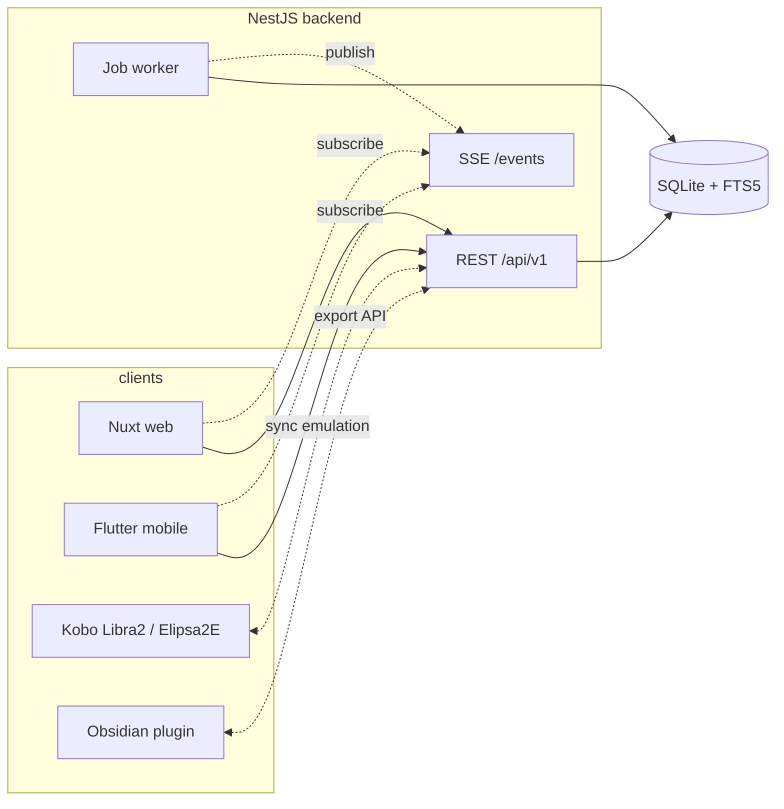

# burkmak — Product Requirements Document

> Self-hosted, multi-user **bookmarks / read-it-later** app with native **Kobo
> e-reader sync** and **Obsidian export**. Built on the spec-first
> NestJS + Nuxt + Flutter monorepo template.

- Status: draft
- Owner: kirill
- Created: 2026-06-13
- Related: [roadmap](./roadmap.md) · [first slice spec](./features/2026-06-13-foundation-and-core.md)

---

## 1. Summary

burkmak lets a person save any web link, optionally pull down a clean,
distraction-free copy of the article, organise their library with tags and
read-state, and — the distinctive part — **read those articles on a Kobo
e-reader** (synced natively over wifi) and **export highlights and notes into
an Obsidian vault**.

It is **self-hosted**: one instance, run by its owner, serving a small number
of accounts (e.g. a household). It is **hybrid**: saving a link is cheap and
instant (metadata only by default); fetching the full article is an explicit,
on-demand action.

## 2. Target users & use cases

- **The self-hoster** who wants to own their read-it-later data instead of
  renting Pocket/Instapaper (Pocket is shutting down — migration matters,
  though import is post-MVP).
- **The Kobo reader** who wants saved long-reads to appear on their Libra 2 /
  Elipsa 2E without manual USB side-loading.
- **The note-taker** who reads, highlights, and wants those highlights to land
  in Obsidian as durable markdown.

Primary jobs-to-be-done:

1. "Save this link in one tap so I can deal with it later."
2. "Give me a clean, readable version of this article."
3. "Put my unread long-reads on my Kobo automatically."
4. "Get my highlights into Obsidian as citations."

## 3. Goals & non-goals

### Goals (the product over its phases)

- One-tap capture from web, mobile share-sheet, and a browser bookmarklet.
- Instant save (metadata) + on-demand full-article extraction with **live
  status** (downloading → ready) via realtime push.
- Organise: tags, read/unread/archive, favorite, full-text search over the
  extracted article body.
- Read: distraction-free reader view with highlights and notes.
- **Kobo sync**: native sync-API emulation so a paired Kobo pulls articles and
  pushes read-state back.
- **Obsidian export**: backend export API + an Obsidian plugin turning
  highlights/notes into vault markdown with citations.
- Multi-user on a single self-hosted instance; every row scoped to its owner.

### Non-goals (explicitly out, at least for now)

- Importing from Pocket/Instapaper/Wallabag (planned, but not MVP).
- Public sharing / collaboration / social features.
- A full published browser **extension** at launch (bookmarklet first; a real
  extension is a later enhancement).
- Horizontal scaling / multi-instance HA. Single instance is the design point.
- Postgres, Redis, Centrifugo, Grafana/OTel — deliberately dropped (see §5).

## 4. Product principles

- **Hybrid, not eager.** Saving never blocks on a network fetch. Metadata and
  article extraction are background jobs.
- **Realtime where it matters.** Anything async reports status live (SSE), so
  the UI never shows a silent spinner of unknown duration.
- **The data outlives the app.** Articles export to EPUB; highlights export to
  markdown. The user is never locked in.
- **Self-hosted simple.** Prefer one process + one file database over a fleet
  of services. Add infrastructure only when a feature truly needs it.

## 5. Architecture & stack

Built on the template monorepo, **simplified**:

| Layer         | Choice                                                           | Notes / deviation from template |
| ------------- | ---------------------------------------------------------------- | ------------------------------- |
| Backend       | NestJS 11 + CQRS + Better Auth + Prisma 7                        | as template                     |
| Database      | **SQLite** (with **FTS5** for full-text search)                  | template default was Postgres   |
| Web           | Nuxt 4 SPA + Nuxt UI v4 + `@app/ui` + `@nuxtjs/i18n`             | as template                     |
| Mobile        | Flutter 3.41 + flutter_bloc + get_it + Dio                       | as template                     |
| Realtime      | **SSE** (`@Sse()` in NestJS)                                     | template used Centrifugo        |
| Background    | **DB-backed in-process worker** (`Job` table + NestJS processor) | template used Redis             |
| Contracts     | **OpenAPI 3.1 only**                                             | AsyncAPI half removed           |
| Observability | none for now                                                     | Grafana/OTel removed            |

### The spine: jobs + SSE (built once, reused everywhere)

Every expensive operation in burkmak is the same shape:

```
client action → enqueue Job → worker runs it → push status over SSE → client updates live
```

This pattern covers `fetch_metadata` (phase 1), `extract_article` (phase 2),
`build_epub` / Kobo delivery (phase 4), and `obsidian_export` (phase 5). The
foundation phase builds the spine; later phases add job types — they do not add
infrastructure.



### Spec-first loop (unchanged from template)

1. Edit `packages/specs/openapi/openapi.yaml`.
2. `pnpm spec:validate && pnpm spec:bundle && pnpm spec:codegen`.
3. Implement in `apps/backend` — `express-openapi-validator` rejects drift.
4. Consume via the regenerated `@app/api-client-{ts,dart}`.

## 6. Subsystem decomposition

burkmak is **six loosely-coupled subsystems**, each shipped via its own
spec → plan → build cycle. See [roadmap.md](./roadmap.md) for the phase order.

| #   | Subsystem            | Scope                                                                                              | Depends on |
| --- | -------------------- | -------------------------------------------------------------------------------------------------- | ---------- |
| S0  | Foundation           | Rename → burkmak, Postgres→SQLite, strip Centrifugo/Redis/Grafana + AsyncAPI, build jobs+SSE spine | —          |
| S1  | Core library         | Items CRUD, async metadata fetch, tags, read/unread/archive/favorite, list+filter, web+mobile UI   | S0         |
| S2  | Extraction & reading | On-demand full-article extraction, reader view, FTS5 body search, highlights & notes               | S1         |
| S3  | Capture surfaces     | Mobile share-sheet target, browser bookmarklet                                                     | S1         |
| S4  | Kobo Sync            | EPUB/KEPUB generation, native Kobo sync-API emulation, device pairing, read-state sync-back        | S2         |
| S5  | Obsidian export      | Backend export API + Obsidian plugin (highlights/notes/citations → vault markdown)                 | S2         |

Dependency shape: **S0 → S1 → S2**, then **S3 / S4 / S5** fan out in parallel.

## 7. Functional requirements by subsystem

### S0 — Foundation

- App boots green with SQLite; health endpoint reports `db: ok`.
- Centrifugo, Redis, Grafana/OTel, and the AsyncAPI spec + Dart/TS realtime
  codegen are removed; CI is green without them.
- A `Job` table + an in-process worker run queued jobs with retry/backoff.
- `GET /api/v1/events` streams per-user SSE events (auth required).
- Template placeholders (`{{APP_NAME}}` etc.) resolved to burkmak.

### S1 — Core library

- `POST /items {url}` creates an item in `status: pending` and returns
  immediately; a `fetch_metadata` job populates title, site name, excerpt,
  lead image, favicon, then emits an SSE `item.updated` event.
- List items with filters: read-state, tag, favorite, and a `q` text match
  (title/url in S1; article body added in S2).
- Per-item: set read-state (unread/read/archived), toggle favorite, assign and
  unassign tags, delete.
- Tags are per-user; create implicitly on first use; rename and delete.
- Every item, tag, and job is scoped to the authenticated user.
- Web and mobile both render the library list, item detail, and add-link flow.

### S2 — Extraction & reading

- `POST /items/{id}/extract` enqueues `extract_article`; status streams via SSE
  (`extracting` → `ready` / `failed`).
- Extracted content stored as sanitized HTML + plain text + word count +
  reading-time estimate; lead images cached locally.
- Reader view (web + mobile) renders the clean article with adjustable
  typography.
- **Full-text search** over title + url + extracted body via SQLite FTS5.
- **Highlights & notes**: select text → create highlight (with optional note
  and color); list/edit/delete; highlights belong to an item and a user.

### S3 — Capture surfaces

- Flutter app registers as a **share target**; sharing a URL from any app
  opens a quick-save that calls `POST /items`.
- A **bookmarklet** (and tokenized save URL) saves the current page from a
  desktop browser in one click. (A packaged extension is a later enhancement.)

### S4 — Kobo Sync

- Generate **EPUB/KEPUB** from an extracted article (or an "unread digest").
- Emulate the **Kobo sync API** so a paired device pulls new articles over wifi
  and pushes read-state back into burkmak.
- **Device pairing** flow (per user, multiple devices) with a clear setup guide
  for Libra 2 / Elipsa 2E.
- Sync respects read-state filters (e.g. only `unread` go to the device).

### S5 — Obsidian export

- Backend **export API** returns a user's highlights/notes/citations in a
  structured, markdown-ready form.
- An **Obsidian plugin** writes one note per article (or appends to a daily
  note) with the source link, metadata, highlights, and personal notes as a
  citation block.
- Idempotent: re-exporting updates rather than duplicates.

## 8. Data model (whole product)

Introduced progressively — the phase that adds each entity is noted.

- **User** — Better Auth (exists). _(S0)_
- **Item** — `id, userId, url, canonicalUrl, title, siteName, excerpt,
leadImageUrl, faviconUrl, status(pending|ready|failed),
readState(unread|read|archived), favorite, savedAt, readAt`. _(S1)_
- **Tag** — `id, userId, name, slug`; **ItemTag** join (m:n). _(S1)_
- **Job** — `id, userId, type, itemId?, status(queued|running|done|failed),
attempts, error, payload, createdAt, startedAt, finishedAt`. _(S0)_
- **Article** — `itemId, contentHtml, contentText, wordCount,
readingTimeMin, extractedAt`. _(S2)_
- **Highlight** — `id, itemId, userId, range, quotedText, note?, color,
createdAt`. _(S2)_
- **KoboDevice** — `id, userId, name, pairingToken, lastSyncAt`. _(S4)_
- **ObsidianExportState** — per-user export config + last-export cursor. _(S5)_

## 9. Non-functional requirements

- **Self-hosted single instance.** Runs via `docker compose` with no external
  managed services. SQLite file is the only persistent store.
- **Privacy.** No third-party analytics; content fetched server-side stays on
  the instance.
- **i18n.** All user-visible strings translatable (template ships en/ru/uk/el).
- **Accessibility.** `@app/ui` parity checklist (keyboard nav, focus-visible,
  a11y smoke tests) applies to every component.
- **Resilience.** Background jobs retry with backoff; a failed fetch never
  loses the saved item (it stays, marked `failed`, retryable).

## 10. Open questions / risks

- **Kobo sync emulation (S4)** is the highest-risk piece: the sync API is
  undocumented and firmware-version-sensitive. Mitigation: build the EPUB/KEPUB
  generation independently first so a manual/cloud-folder fallback always
  exists even if live sync proves brittle.
- **Article extraction quality (S2)** varies by site (paywalls, JS-rendered
  pages). Mitigation: pick a robust extractor (e.g. Readability-class) and
  always keep the original URL + metadata so a failed extraction degrades to a
  plain bookmark.
- **Obsidian highlight mapping (S5)** — deciding note granularity (one note per
  article vs. daily-note append) is a UX call to settle when S5 is specced.
- **SQLite write concurrency** under the worker + API both writing: use WAL
  mode; revisit only if contention appears.

---

## 11. Design brief — for Claude Design / open-design

> Paste the block below into **claude.ai / Claude Design** (or open-design) to
> generate the design system + screen mockups. It follows the repo's design
> contract exactly (see `.claude/docs/design-system.md` and
> `specs/design/README.md`), so the returned bundle drops into
> `specs/design/` and runs through `pnpm design:build` with no reformatting.

```
I'm designing the UI for **burkmak**, a self-hosted, multi-user
bookmarks / read-it-later app. Users save web links, optionally fetch a clean
distraction-free copy of the article, organise with tags and read-state, read
in a reader view with highlights, sync articles to a Kobo e-reader, and export
highlights to Obsidian. Tone: calm, focused, reading-first; high legibility;
excellent dark mode (people read at night on e-ink-adjacent screens). Think
"a quiet reading app," not "a busy dashboard."

Please produce BOTH artefact kinds below so they drop into the repo with no
manual reformatting.

### 1. Token JSON (W3C DTCG format)

One JSON file per category, matching this layout exactly:

- color.json       — brand (accent/accentHover/accentActive/accentFg/accentSubtle),
                     surface (page/surface/raised/overlay), border (default/muted/strong),
                     text (fg/muted/subtle/inverse), status (success/warning/danger/info),
                     each as { light: {...}, dark: {...} }
- typography.json  — font families (a highly legible serif or humanist sans for
                     long-form reading body text + a UI sans), weights, sizes,
                     tracking, leading, text roles (displayLg, headlineMd, titleSm,
                     body, readerBody, caption, …)
- spacing.json     — 4 px grid scale (space.0 … space.24)
- radius.json      — sm / md / lg / xl / full
- shadow.json      — elevation presets, light + dark variants
- motion.json      — duration (fast/base/slow), easing (standard/decelerate/accelerate),
                     lift, z-index scale
- opacity.json     — muted / subtle / disabled / scrim

Token shape: { "$value": "...", "$type": "color" | "dimension" | "duration" | ... }
Themeable tokens wrap values:
  { "light": { "$value": "#…", "$type": "color" }, "dark": { "$value": "#…", "$type": "color" } }
Every colour MUST have both light and dark values. No hex literals outside
token JSON. No Tailwind class names in tokens.

### 2. JSX/TSX mockups — one file per screen

- File naming: kebab-case route — library.tsx, sign-in.tsx, reader.tsx, …
- Self-contained React components — no external imports besides React.
- Styling ONLY via CSS variables from the tokens:
    color   → var(--brand-accent), var(--text-fg), var(--surface-page), …
    spacing → var(--space-4)
    radius  → var(--radius-md)
    shadow  → var(--shadow-md)
    motion  → var(--duration-base), var(--easing-standard)
  NO hex, NO px literals, NO Tailwind utilities, NO inline style={{}} with raw values.
- BEM class names prefixed app-<name>: .app-item-card, .app-item-card__title, …
- Include every state each screen needs: default / hover / focus-visible /
  active / disabled / loading(skeleton) / empty / error, plus burkmak-specific
  item states: pending (metadata fetching), ready, extracting, failed.
- Include both a light and a dark rendering of each screen.

### Screens to design

MVP (phases S0–S1) — design these first:
- welcome.tsx        — first-run / value prop + sign-in entry
- sign-in.tsx, sign-up.tsx
- library.tsx        — the main saved-items list: filter bar (unread / read /
                       archived / favorite), tag filter, search field, and item
                       cards showing favicon, title, site, excerpt, tags,
                       state badge, quick actions (archive, favorite, delete).
                       Show loading(skeleton), empty, populated, and an item in
                       the "pending" (metadata fetching) state.
- add-link.tsx       — paste-a-URL quick add (as a modal/sheet and inline bar).
- item-detail.tsx    — single item: metadata, tags, read-state controls, and a
                       prominent "Fetch full article" action.

Near-term (phases S2+) — design so the system is coherent:
- reader.tsx         — distraction-free article reader with adjustable
                       typography; text-selection → highlight popover.
- highlights.tsx     — list of a user's highlights & notes.
- tags.tsx           — manage tags (rename / delete / counts).
- settings.tsx       — profile, theme (light/dark/system), language.
- settings-kobo.tsx  — pair a Kobo device, list paired devices, sync status.
- settings-obsidian.tsx — connect Obsidian, export options.

### Component inventory to use / extend

Reuse template primitives: AppButton, AppBadge, AppChip, AppInput, AppSelect,
AppSwitch, AppTextarea, AppField, AppLabel, AppCard, AppIcon.
Add burkmak compositions (name them App<Name> and list any new primitive):
- AppItemCard      — a saved-item row/card (favicon, title, site, excerpt,
                     tags, state badge, actions).
- AppStatusBadge   — pending / ready / extracting / failed.
- AppFilterBar     — read-state segmented control + tag filter + search.
- AppTagChip       — selectable/removable tag.
- AppEmptyState, AppSkeleton — list loading & empty.
- AppReaderToolbar — typography & theme controls in the reader.
- AppHighlightPopover — highlight + add-note on text selection.
- AppSyncStatus    — Kobo / job sync indicator.

### Output format

Return a single zip-ready bundle:

  design-bundle/
    tokens/
      color.json
      typography.json
      spacing.json
      radius.json
      shadow.json
      motion.json
      opacity.json
    mockups/
      welcome.tsx
      sign-in.tsx
      sign-up.tsx
      library.tsx
      add-link.tsx
      item-detail.tsx
      reader.tsx
      highlights.tsx
      tags.tsx
      settings.tsx
      settings-kobo.tsx
      settings-obsidian.tsx
    README.md    # list of screens, design decisions, open questions
```

### Loading the returned bundle

1. `tokens/*.json` → `specs/design/tokens/` (overwrite, keep filenames).
2. `mockups/*.tsx` → `specs/design/mockups/`.
3. `README.md` → append to `specs/design/mockups/README.md`.
4. Run `pnpm design:build`, then verify in Storybook (`pnpm storybook`).
5. Push each new screen as a task in `specs/tasks/active.md`.

If the bundle drifts from the contract, go back to Claude Design with the
specific gap rather than hand-patching — the brief is the contract.
